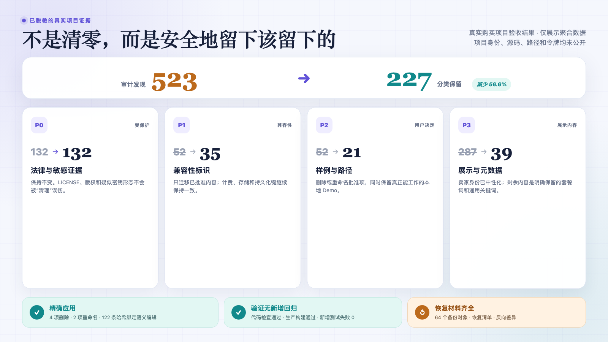
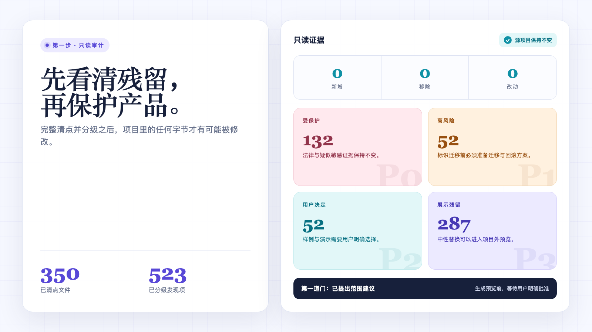
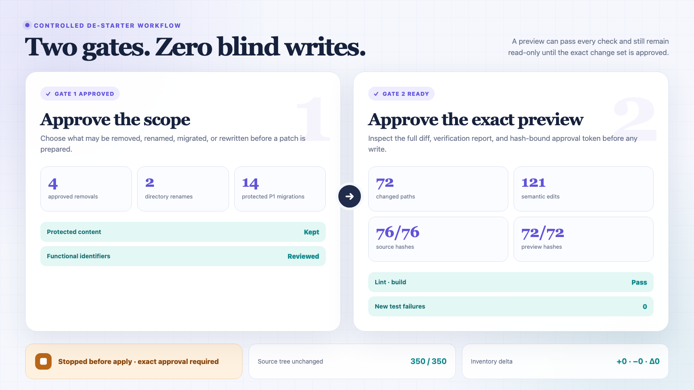
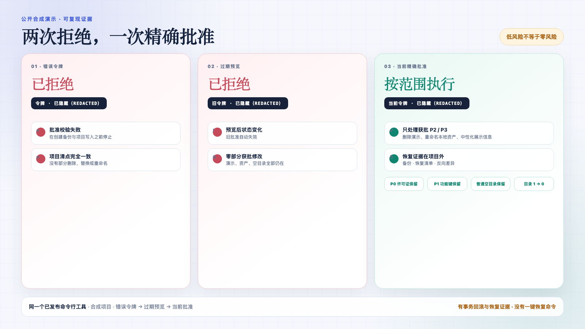
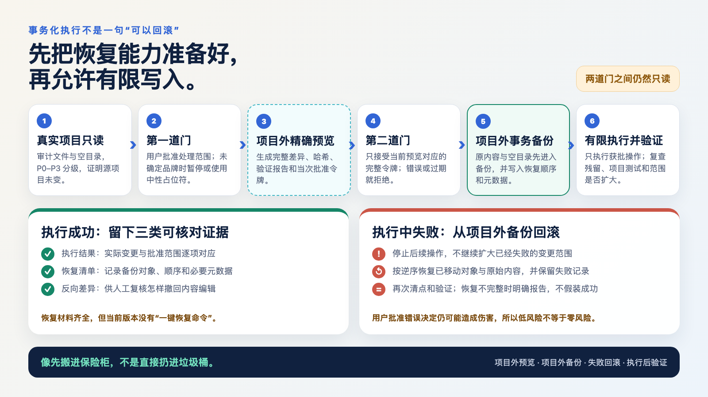
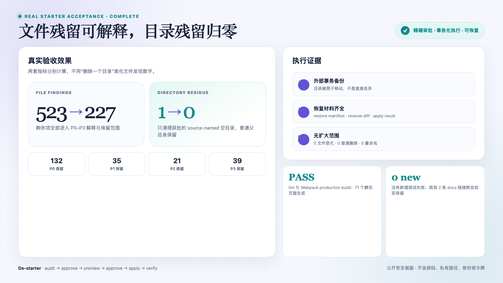
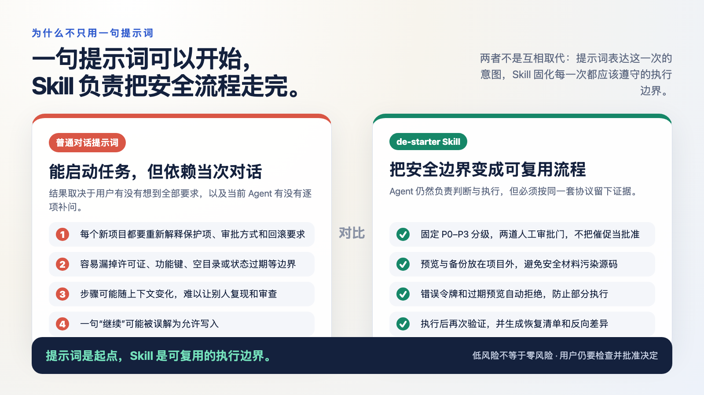

# De-starter 中文视频导演稿

建议成片：14–16 分钟，横屏 16:9，中文旁白 + 屏幕证据。出镜可选。

## 使用方法

每个镜头都写明时间码、屏幕画面、鼠标重点、逐字口播、证据证明什么、观众应记住什么、不能说什么和转场。录制时先读“鼠标重点”，确认画面准备好，再开始该段口播。

## 证据边界

- 真实购买 Starter：证明 523 → 227、目录 1 → 0、P0 不变、新增测试失败 0、构建成功和恢复材料齐全。
- 公开合成实验：证明错误令牌、过期预览和当前精确批准三条路径。
- Skill 与公开 CI：证明 214 项回归和 Python 3.9 / 3.11 / 3.13。

## 00:00–00:45 开场：一句话为什么变成了一个 Skill

### 屏幕画面

先展示 `03-before-after.png` 的 523 → 227，再切到 `01-audit-overview.png` 的四张 P0–P3 卡片。

### 鼠标重点

先圈出 523 和 227，不要只停在“减少了多少”；然后移动到 P0 的 132 → 132。

### 逐字口播

> 我买了一个 AI SaaS Starter，最开始只对 AI 说了一句话：帮我把这个项目里的 Starter 痕迹去掉。听起来好像就是搜关键词、批量替换，但真正扫完以后，我看到了 523 条发现。这里面不只有卖家名字，还有 LICENSE、支付计划 key、数据库和认证标识、Demo、评价、样例资产、仓库链接，甚至还有文件扫描看不到的空目录。
>
> 如果我把这些东西全部当成“残留”一键删除，可能卖家名字没了，产品的支付、认证和法律证据也一起坏了。所以我最后做的不是一个全局替换脚本，而是一个带风险分级、两道人工审批、项目外预览和恢复证据的 Agent Skill，名字叫 de-starter。

### 证据证明什么

真实任务的难点是分类和边界，不是关键词数量。

### 观众应记住

观众应记住：去 Starter 痕迹最危险的不是少删几个词，而是把仍在工作的产品能力一起删掉。

### 不能说什么

不能说“它自动把所有 Starter 痕迹清零”，也不能说“使用后绝不会破坏项目”。

### 转场

从 P0 卡片放大，进入“为什么直接搜索替换不安全”。

## 00:45–02:35 为什么直接搜索替换不安全

### 屏幕画面

展示 `01-audit-overview.png`，按照 P0、P1、P2、P3 顺序高亮。

### 鼠标重点

先指顶部“源项目没有变化”，再从 P0 横向移动到 P3。每张卡停留约 5 秒。

### 逐字口播

> 为什么不能直接搜索替换？因为同一个来源名称，出现在不同位置时，含义完全不同。它出现在 LICENSE 里，可能是必须保留的版权证据；出现在支付计划或数据库字段里，可能已经和真实数据兼容；出现在 Demo 页面里，需要我决定这个 Demo 是卖家的样例垃圾，还是我产品仍然需要的功能；只有出现在页面标题、SEO、邮箱签名或仓库信息里，才比较适合直接中性化。
>
> 普通搜索只能告诉我“这个词出现了”，但不能自动证明“这里可以删”。所以 de-starter 的第一步始终是只读审计。画面上新增、删除和变化都是零，因为在分类完成、用户批准之前，真实项目不应该改变一个字节。

### 证据证明什么

只读审计把“发现”与“允许修改”分开。

### 观众应记住

观众应记住：关键词命中只是线索，不是删除授权。

### 不能说什么

不能把 P0–P3 说成简单的“从危险到安全”；它们对应的是四种不同处理方式。

### 转场

四张卡保持在屏幕上，进入四级规则的具体解释。

## 02:35–04:30 P0–P3：不是四个严重程度，而是四种处理方式

### 屏幕画面

继续展示 `01`，随后切到 `03-before-after.png` 的四栏前后变化。

### 鼠标重点

依次指向 P0 132、P1 52、P2 52、P3 287，再切换到处理后的 132、35、21、39。

### 逐字口播

> P0 是法律、版权、疑似密钥和生产数据。默认只报告，不允许自动修改。真实实验里 P0 是 132 条，处理以后仍然是 132，一条都没动。
>
> P1 是支付、认证、数据库、API 和其他持久化标识。它们不是永远不能改，但必须先写清楚迁移方案和回滚方案。没有方案就保留。真实实验里 P1 从 52 变成 35，只迁移了明确批准的 14 项高风险编辑。
>
> P2 是 Demo、样例、评价、测试数据和资产。这里没有统一答案，必须让用户选择。P3 才是展示品牌、SEO、邮件签名和仓库元数据，通常适合进入中性化预览。
>
> 这也是为什么最后还有 227 条发现。它们不是漏扫，而是已经分类并明确保留的法律证据、兼容标识、有用 Demo 和通用业务词。

### 证据证明什么

523 → 227 是分类治理结果，不是用更窄的关键词制造漂亮数字。

### 观众应记住

观众应记住：安全清理的目标不是清零，而是每一条留下或修改都有理由。

### 不能说什么

不能说“227 条没清干净”，也不能把 P1 修改描述成普通文案替换。

### 转场

从四栏结果淡出，切换到两道审批流程图。

## 04:30–06:30 两道人工审批门

### 屏幕画面

展示 `02-safety-gates.png`，再切到 `05-empty-dir-gate-two.png`。

### 鼠标重点

第一遍只指左侧“允许范围”；第二遍指右侧“精确预览”；最后指底部“应用前停止”。

### 逐字口播

> 第一道审批门批准的是“允许做什么”。例如哪四项删除、哪两个目录重命名、哪些展示文案可以中性化、哪些 P1 已经准备好迁移和回滚，以及哪一个空目录允许单独清理。
>
> 第一道门通过以后，Skill 仍然不会直接改真实项目。它会在项目外生成一个完整 Preview，也就是预览副本，同时生成完整 diff、二进制变化、语义编辑摘要、目录状态和验证结果。
>
> 第二道审批门批准的是“这一次具体会发生什么”。当前源码状态、预览内容、操作集合、目录身份和审批材料的哈希会绑定成一个 64 位 token。用户必须检查当前预览，再明确提交当前 token。哪怕只多批准一个空目录，都必须重新生成 Preview 和 token。
>
> 所以用户说“你帮我决定”“全部替换”或者“赶紧处理”，都不能被当成第二道门的精确批准。

### 证据证明什么

范围审批和最终写入审批是两件事；预览完成也不代表获得写权限。

### 观众应记住

观众应记住：第一道门决定能做什么，第二道门决定当前这一版到底会改什么。

### 不能说什么

不能展示真实 token，不能把 token 叫作永久授权，也不能说 Preview 通过就会自动 Apply。

### 转场

画面落到被遮罩的 token 区域，转入两次拒绝实验。

## 06:30–08:15 错误令牌与过期预览

### 屏幕画面

展示 `08-public-demo-safety.png`，从左到右依次停留。

### 鼠标重点

先指“错误令牌：拒绝”和“清单完全一致”，再指“过期预览：拒绝”和“没有部分修改”，最后才指当前精确批准。

### 逐字口播

> 为了让大家不用只相信我的描述，我做了一个完全虚构的公开合成实验。这里必须说清楚：这两次拒绝来自完全虚构的公开合成实验，不是我在购买的真实项目里故意制造破坏。
>
> 第一遍，我故意提交错误 token。结果是在项目写入、backup 和 apply-result 产生之前直接拒绝，前后 inventory 完全一致。
>
> 第二遍，我先生成 Preview，然后故意改变合成项目里的一个文件，再提交刚才正确但已经过期的旧 token。结果仍然拒绝。获批的 Demo、资产重命名和空目录清理都没有执行一半。
>
> 只有重新生成 Preview、重新检查私有 diff，并提交当前精确 token，获批的 P2 和 P3 才会执行。P0 LICENSE、P1 账单 key 和普通空目录继续保留。

### 证据证明什么

凭证错误或现场变化都会在写入前失败关闭，不会留下“删了一半”的批准操作。

### 观众应记住

观众应记住：错误令牌不写，旧预览不写，只有当前精确批准的范围才写。

### 不能说什么

不能把合成实验说成真实购买项目的破坏测试，也不能说任何错误决策都能被自动识别。

### 转场

从右侧“限定执行”向下移动到“恢复证据在项目外”，进入事务部分。

## 08:15–10:25 事务化备份、回滚和空目录清理

### 屏幕画面

先展示 `10-transaction-recovery.png`，再切 `05` 和 `06`。

### 鼠标重点

沿流程箭头走一遍；在 backup 节点停留；随后分别指成功证据和失败回滚分支。

### 逐字口播

> 真正执行时，de-starter 不是先改文件、失败了再想办法补救。原始对象会先通过不可覆盖的原子移动进入项目外 backup。你可以把它理解成先搬进保险柜，而不是直接扔进垃圾桶。
>
> 空目录也不是随手执行 rmdir。它必须在审计里有独立目录发现，第一道门明确批准，第二道门绑定目录的状态和身份，Apply 前再证明它仍然为空。真实实验最后一次操作是零文件变化、零普通删除、零重命名，只清理一个获批空目录，普通父目录继续保留。
>
> 如果事务中途失败，系统按照已经记录的执行阶段尝试回滚。回滚目标如果出现了外来文件，系统宁愿保留 backup 并报告恢复不完整，也不会为了看起来“恢复成功”覆盖别人的新内容。
>
> 这里也不能夸大：v0.1.2 有事务失败自动回滚、外部 backup、restore.json、reverse.diff 和 apply-result.json，但没有一键恢复命令。

### 证据证明什么

删除、备份和恢复属于同一个事务边界；目录清理有独立授权，不会扩大到普通空目录。

### 观众应记住

观众应记住：复杂的不是删除空目录，而是保证异常发生时不覆盖外来数据。

### 不能说什么

不能说“一键恢复”，不能说所有失败都一定能完全恢复，也不能把 backup 路径公开。

### 转场

从 `06` 的目录 1 → 0 缩放到文件 523 → 227，进入完整验收结果。

## 10:25–12:35 214 项测试和真实 Starter 验收

### 屏幕画面

依次展示 `03-before-after.png`、`06-empty-dir-final.png`、`07-github-ci-green.png`。

### 鼠标重点

先看 P0 132 不变，再看目录 1 → 0；最后在 07 上按“本地 → Linux → 三档 CI”移动。

### 逐字口播

> 真实 Starter 的文件发现从 523 降到 227，减少 296 条，也就是 56.6%。P0 仍然是 132；P1 从 52 到 35；P2 从 52 到 21；P3 从 287 到 39。目录是另一套指标，从 1 到 0，没有混进文件数字里。
>
> 真实项目 lint 通过，Webpack production build 成功并生成 71 个静态页面。真实 Starter 的项目测试是 63/65，而且处理前后都是同两条文档链接断言失败，新增失败为 0。
>
> 214 项是 de-starter 自身的回归测试；真实 Starter 的项目测试是 63/65，而且前后都是同两条文档链接断言失败，新增失败为 0。这两组数字不能混在一起。
>
> Skill 本身最终 214/214 通过。公开 GitHub CI 还在 Python 3.9、3.11 和 3.13 上运行。Linux 曾经发现一个 macOS 没暴露的 inode 复用测试假设，修复的是测试可移植性，不是掩盖失败。当前 v0.1.2 三档全绿。

### 证据证明什么

真实项目功能验证、Skill 回归和公开跨平台 CI 分别成立，并且没有把历史失败改写成“一次就过”。

### 观众应记住

观众应记住：真实效果看 523 → 227 和新增失败 0；Skill 稳定性看 214/214 和三档 CI。

### 不能说什么

不能把 214 项说成真实 Starter 的项目测试，也不能把证据重绘卡说成 GitHub 原始网页截图。

### 转场

从 214/214 切换到左右对比图，回答“既然一句话也能开始，为什么还要 Skill”。

## 12:35–14:20 普通提示词和 Skill 的差别

### 屏幕画面

展示 `09-prompt-vs-skill.png`。

### 鼠标重点

先读左栏的“依赖当前对话”，再逐项切换到右栏对应的固定边界，最后落到底部总结。

### 逐字口播

> 普通提示词当然可以开始这个任务。我自己最初也只说了一句“帮我去掉 Starter 痕迹”。所以 Skill 的价值不是让用户多背一句复杂口令。
>
> 差别在后面的流程。一次性对话要靠 Agent 临场想起版权、支付 key、Demo 选择、两次审批、外部备份、目录身份、过期预览和验证。换一个项目、换一个用户、换一个新对话，这些提醒很容易缺一项。
>
> Skill 把它们固化成可复用 SOP 和真实工具：相同的 P0–P3、相同的审批门、相同的 token 失效规则、相同的 backup 和验证证据。提示词是起点，Skill 是可复用的执行边界。

### 证据证明什么

比较的是流程稳定性与可复用性，不是否定普通对话能力。

### 观众应记住

观众应记住：一句话能启动任务，但 Skill 让下一次任务仍然遵守同一套安全边界。

### 不能说什么

不能说普通提示词一定不安全，也不能说 de-starter 是独立 Agent。

### 转场

对比图缩小，切换到 GitHub Social Preview 和 README。

## 14:20–15:20 适用范围、限制和 GitHub 获取方式

### 屏幕画面

展示中文 Social Preview，然后切到 GitHub README 的 Quick links、Install、风险提示和反馈入口。

### 鼠标重点

先指“低风险不等于零风险”，再指 Install、公开 Demo、最终报告和 Feedback。

### 逐字口播

> de-starter 适合买来的 SaaS Starter、模板、boilerplate、克隆项目和课程代码，特别是已经带认证、支付、数据库和 Demo 的项目。
>
> v0.1 目前只支持具备 POSIX 安全能力的 macOS 和 Linux；项目与外部运行目录需要在同一文件系统。它不能替代法律审查、生产密钥管理或真实支付迁移演练。低风险不等于零风险，用户明确批准的错误决定仍然可能产生不希望的修改。
>
> 仓库已经公开在 GitHub，名字是 de-starter。README 里有安装方式、五分钟公开合成演示、完整脱敏实验报告和反馈入口。如果你愿意测试，请只提交完全合成的复现，不要把购买源码、真实路径、token 或凭据放进公开 Issue。
>
> 这是我第一次从自己的真实问题出发，做一个可以给别人复用的 Agent Skill。如果这套过程也能帮你更安全地接手模板项目，欢迎到 GitHub 看看。

### 证据证明什么

仓库不仅提供代码，还提供安装、可复现实验、风险边界、证据与隐私安全反馈入口。

### 观众应记住

观众应记住：它不是“一键全删”，而是让每一次修改都有分类、批准、证据和恢复边界。

### 不能说什么

不能说支持 Windows，不能承诺所有 Starter 都会得到相同数字，也不能邀请用户公开真实购买源码。

### 转场

停留 GitHub 仓库地址 4 秒，音乐淡出。

## 录制前最后检查

- 画面 01–10 已全部中文化；技术标识旁有中文解释。
- 画面 07 显示 214/214 和 v0.1.2，不再把 v0.1.1 当作当前版本。
- token 只显示“已遮罩”，不出现任何 64 位真实值。
- 不展示真实 Starter 的源码、路径、品牌、卖家身份、邮箱、域名、backup 映射或私有 diff。
- 口播区分真实验收、公开合成实验、Skill 测试与 CI。
- 不说零风险、一键恢复、全网第一或市场最强。
